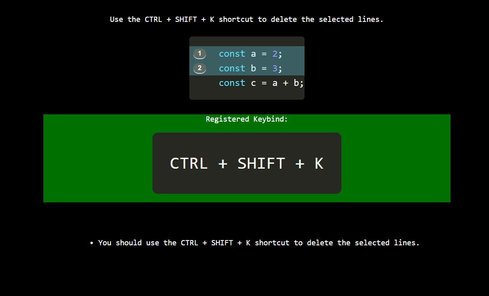

# Key Code

Interactively learn the VSCode shortcut keys.

To use, open the command palette and run the command: `Key Code: Start`

This extension will prompt to create a new file in your workspace name `key-code.js`. Once that is created, the extension will serve the lessons in a WebView.

#

## [Release Notes](CHANGELOG.md)

## Known Issues

- Webview does not support some of the currently used CSS properties.
- Extension prevents keybindings from working, when Webview is closed.

Be sure to DEACTIVATE the extension, when not in use.
